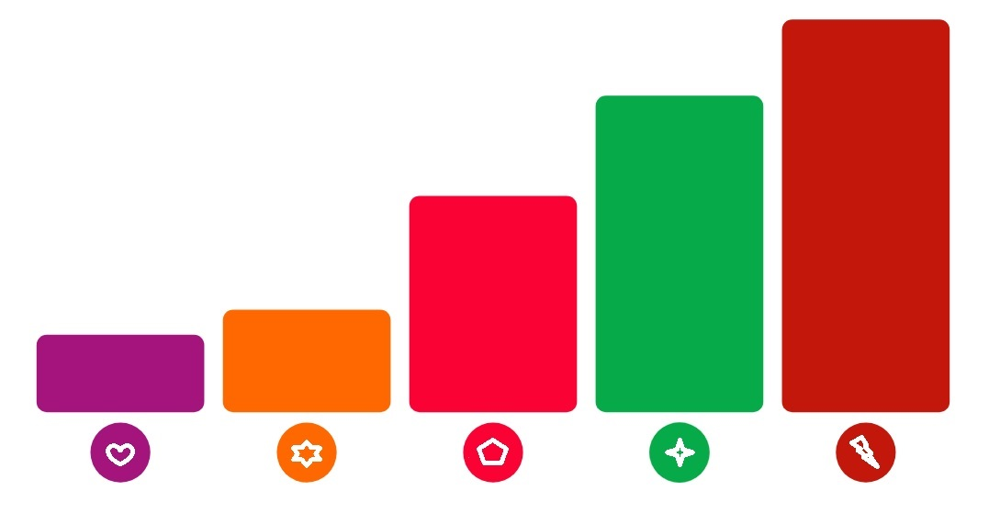

# Looker - Visualizações Personalizadas



Projeto para criação de gráficos personalizados para o Looker

> ### **1 - Organização de pastas e arquivos**

---

`**./dist/[name].js**`: Arquivo de distribuição.

`**manifest.lkml**`: Arquivo de configuração de dependências externas do Looker. O objeto de visualização é definido aqui

`**marketplace.json**`: Um arquivo JSON contendo informações que o instalador do Marketplace usa para configurar este projeto.

`**/src**`: Este diretório conterá todo o código-fonte da visualização.

`**/src/[nome do gráfico].js**`: Arquivo **principal** que importará o index.js da pasta da visualização

`**/src/charts/[pasta do gráfico]/index.js**`: O código-fonte da visualização.

> ### **2 - Documentação oficial**

---

[https://github.com/looker/custom_visualizations_v2/blob/master/docs/api_reference.md](https://github.com/looker/custom_visualizations_v2/blob/master/docs/api_reference.md)

> ### **3 - Criar um novo gráfico dentro do projeto**

---

**No prompt de comando, execute o seguinte comando na raiz do projeto:**

```
node ./src/core/create.js [nome do gráfico sem espaços]
```

**Exemplo real de uso:**

```
node ./src/core/create.js banner
```

> ### **4 - Para gerar o JS de distribuição que será usado no looker:**

---

**No prompt de comando, entre na raiz do projeto e execute:**

```
yarn [nome do gráfico sem espaços]
```

**Exemplo real de uso:**

```
yarn banner
```

**Será gerado um arquivo javascript com o mesmo nome do gráfico na pasta ./dist**

_**https://github.com/RubinderS/HTMLBuilder**_
