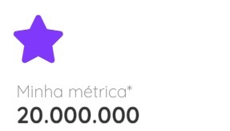

# Looker - Visualizações Personalizadas


## **Projeto para criação de gráficos personalizados para o Looker**

> ### **1 - Instalar as bibliotecas do NODEJS**

**Executar o comando na raiz do projeto e também dentro da pasta /developer**

```
yarn install
```

> ### **2 - Organização de pastas e arquivos**

`**./dist/[name].js**`: Arquivo de distribuição.

`**manifest.lkml**`: Arquivo de configuração de dependências externas do Looker. O objeto de visualização é definido aqui

`**marketplace.json**`: Um arquivo JSON contendo informações que o instalador do Marketplace usa para configurar este projeto.

`**/src**`: Este diretório conterá todo o código-fonte do projeto.

`**/src/[nome do gráfico].js**`: Arquivo **principal** que importará o index.js da pasta da visualização

`**/src/charts/[pasta do gráfico]/index.js**`: O código-fonte da visualização.

`**/developer*`: Diretório para desenvolvimento em localhost.

> ### **3 - Documentação oficial do Looker Custom Visualization**

[https://github.com/looker/custom_visualizations_v2/blob/master/docs/api_reference.md](https://github.com/looker/custom_visualizations_v2/blob/master/docs/api_reference.md)

> ### **4 - Criar um novo gráfico dentro do projeto**

**No prompt, execute o seguinte comando na raiz do projeto:**

```
yarn chart [nome do gráfico sem espaços]
```

**Exemplo real de uso:**

```
yarn chart banner
```

> ### **5 - Gerar o JS de distribuição que será usado no looker:**

**No prompt, entre na raiz do projeto e execute:**

```
yarn [nome do gráfico sem espaços]
```

\*Atenção: Não use caracteres especiais no nome do gráfico

**Exemplo real de uso:**

```
yarn banner
```

\*_Será gerado um arquivo javascript na pasta ./dist com o mesmo nome do gráfico_

> ### **6 - Ambiente de desenvolvimento:**

**Entre no diretório /developer e no prompt e execute o seguinte comando:**

```
yarn dev
```

**Abra o browser de sua preferência e entre no endereço: http://localhost**

**Local do arquivo de edição do gráfico:**

/developer/views/chart.html

> ### **7 - Adicionando um novo icone no título do gráfico pelo explore do looker:**

```
<span style="font-size: 18px" class="material-symbols-outlined">
  <span>signal_cellular_alt</span>
</span>
```

Use os ícones disponibilizados pelo Google na seguinte URL:

[https://fonts.google.com/icons?icon.query=chart](https://fonts.google.com/icons?icon.query=chart)

> ### **8 - Exemplos de código**



```javascript
//BEGIN
let colors = params.config.colors;
let countColor = 0;
let dataKeys = Array();
params.data.forEach(function (d) {
  dataKeys.push(d[params.queryResponse.fields.dimensions[0].name]["value"]);
});

let formattedData = Array();
params.data.forEach(function (d) {
  let color = colors[countColor] ? colors[countColor] : "#FFA500";
  let dimension = d[params.queryResponse.fields.dimensions[0].name]["value"];
  let measure = d[params.queryResponse.fields.measures[0].name]["value"];
  formattedData.push({
    name: dimension,
    value: measure,
    itemStyle: { color: color },
  });
  countColor++;
});

const chartData = {
  graphic: {
    tooltip: {
      trigger: "axis",
      formatter: function (param) {
        return [
          `<span style="
           font-size: 9px;
           font-family: 'Quicksand', sans-serif;
           font-weight: bold;
           ">${params.config.title_description}</span>`,
        ].join("");
      },
      style: {
        fontSize: 10,
        fontWeight: "normal",
        fill: "#8a8a8a",
        fontFamily: "'Quicksand', sans-serif",
      },
    },
    elements: [
      {
        type: "text",
        left: "5",
        top: 70,
        style: {
          text: "Consumidores únicos*",
          textAlign: "center",
          fontSize: 17,
          fontWeight: "normal",
          fill: "#8a8a8a",
          fontFamily: "'Quicksand', sans-serif",
        },
      },
      {
        type: "text",
        left: "5",
        top: 90,
        style: {
          text: "20.000.000", // Sua métrica estática
          textAlign: "center",
          fontSize: 23,
          fontWeight: "bold",
          fill: "#333",
          fontFamily: "'Quicksand', sans-serif",
        },
      },
    ],
  },
};

if (d3.select("#icon").size() == 0) {
  let icon = d3.select("#chart-content").append("div").attr("id", "icon");
} else {
  let icon = d3.select("#icon");
}

d3.select("#icon").html(`
  <div style="position:absolute;top: 0; left:5">
        ${params.config.default_icon}
  </div>`);
//END
```
